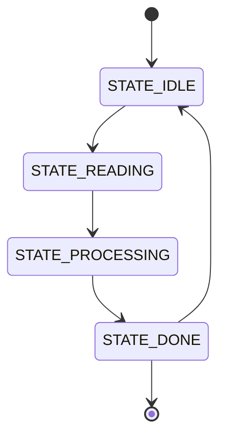
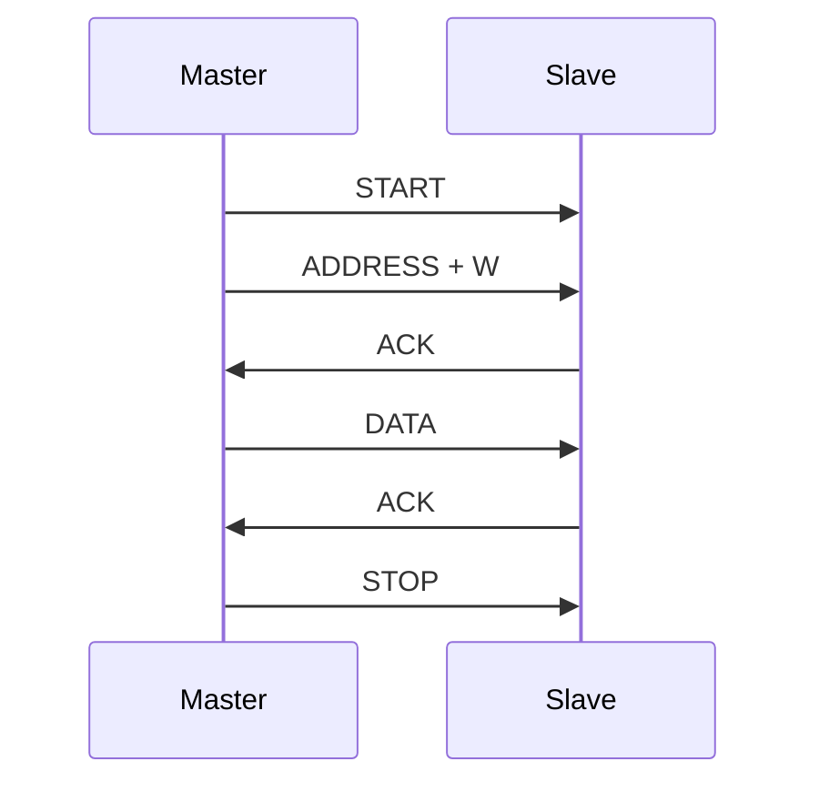

# Mermaid Diagram Generator

Generates Mermaid diagrams from Arduino code to visualize state machines, timing, architecture, and workflows.

## Resources

- **scripts/generate_diagram.py** - Python script with PEP 723 inline dependencies
- **references/diagram-templates.md** - Mermaid templates for common patterns
- **assets/examples/** - Example diagrams for reference

## Quick Start

```bash
# Generate state machine diagram from Arduino code
uv run mermaid-diagram-generator/scripts/generate_diagram.py \
    --input src/main.ino \
    --type state-machine \
    --output docs/state-machine.mmd

# Generate timing diagram for I2C communication
uv run mermaid-diagram-generator/scripts/generate_diagram.py \
    --type timing \
    --signals "SDA,SCL,START,DATA,STOP" \
    --output docs/i2c-timing.mmd

# Interactive mode
uv run mermaid-diagram-generator/scripts/generate_diagram.py --interactive
```

## When to Use

Use this skill when:
- **Visualizing state machines** - FSM from switch/case or enum states
- **Documenting timing** - I2C, SPI, UART protocol sequences
- **Architecture diagrams** - Show task relationships in FreeRTOS
- **Flowcharts** - Visualize control flow for complex logic
- **Sequence diagrams** - Inter-task communication patterns

**Don't use when:**
- ❌ Simple code (3-5 lines) doesn't need visualization
- ❌ No state/timing complexity to illustrate

## Core Principles

1. **Code Analysis** - Parse Arduino code to extract states, transitions, timing
2. **Template Selection** - Choose appropriate Mermaid diagram type
3. **Auto-Generation** - Produce valid Mermaid syntax from code patterns
4. **Validation** - Check diagram syntax before output
5. **Integration** - Embed diagrams in README.md or documentation

## Implementation

### Pattern 1: State Machine Extraction

```python
#!/usr/bin/env python3
# /// script
# requires-python = ">=3.8"
# dependencies = ["re"]
# ///

"""Extract state machine from Arduino code."""

import re

def extract_states(code):
    """Find enum states or #define constants."""
    states = []
    
    # Pattern 1: enum StateType { STATE_A, STATE_B, ... }
    enum_pattern = r'enum\s+\w+\s*\{([^}]+)\}'
    enum_match = re.search(enum_pattern, code)
    if enum_match:
        states_str = enum_match.group(1)
        states = [s.strip().split('=')[0].strip() 
                 for s in states_str.split(',') if s.strip()]
    
    # Pattern 2: #define STATE_A 0
    define_pattern = r'#define\s+(STATE_\w+)\s+\d+'
    states += re.findall(define_pattern, code)
    
    return list(set(states))

def extract_transitions(code, states):
    """Find state transitions in code."""
    transitions = []
    
    for i, state in enumerate(states):
        # Look for assignments: currentState = NEXT_STATE
        pattern = rf'{state}.*?=\s*(\w+)'
        matches = re.findall(pattern, code)
        
        for next_state in matches:
            if next_state in states and next_state != state:
                transitions.append((state, next_state))
    
    return transitions

# Example usage
arduino_code = '''
enum State {
    STATE_IDLE,
    STATE_READING,
    STATE_PROCESSING,
    STATE_DONE
};

State currentState = STATE_IDLE;

void loop() {
    switch(currentState) {
        case STATE_IDLE:
            if (buttonPressed()) {
                currentState = STATE_READING;
            }
            break;
        case STATE_READING:
            readSensor();
            currentState = STATE_PROCESSING;
            break;
        case STATE_PROCESSING:
            processData();
            currentState = STATE_DONE;
            break;
        case STATE_DONE:
            currentState = STATE_IDLE;
            break;
    }
}
'''

states = extract_states(arduino_code)
transitions = extract_transitions(arduino_code, states)

print("States:", states)
print("Transitions:", transitions)
```

### Pattern 2: Generate State Diagram

```python
def generate_state_diagram(states, transitions):
    """Generate Mermaid state diagram."""
    mermaid = ["```mermaid", "stateDiagram-v2"]
    
    # Add initial state
    mermaid.append(f"    [*] --> {states[0]}")
    
    # Add transitions
    for from_state, to_state in transitions:
        mermaid.append(f"    {from_state} --> {to_state}")
    
    # Add final state if applicable
    if states and 'DONE' in states[-1]:
        mermaid.append(f"    {states[-1]} --> [*]")
    
    mermaid.append("```")
    return '\n'.join(mermaid)

# Generate diagram
diagram = generate_state_diagram(states, transitions)
print(diagram)
```

**Output:**
````markdown

````

### Pattern 3: Flowchart from Code Structure

```python
def generate_flowchart(code):
    """Generate flowchart from Arduino function."""
    flowchart = ["```mermaid", "flowchart TD"]
    
    # Parse function structure
    if 'if' in code:
        flowchart.append('    A["Start"] --> B{"Condition?"}')
        flowchart.append('    B -->|Yes| C["Action A"]')
        flowchart.append('    B -->|No| D["Action B"]')
        flowchart.append('    C --> E["End"]')
        flowchart.append('    D --> E')
    
    flowchart.append("```")
    return '\n'.join(flowchart)
```

### Pattern 4: Timing Diagram Generation

```python
def generate_timing_diagram(signals):
    """Generate timing diagram for protocol analysis."""
    timing = ["```mermaid", "sequenceDiagram"]
    
    timing.append("    participant M as Master")
    timing.append("    participant S as Slave")
    timing.append("")
    timing.append("    M->>S: START")
    timing.append("    M->>S: ADDRESS + W")
    timing.append("    S->>M: ACK")
    timing.append("    M->>S: DATA")
    timing.append("    S->>M: ACK")
    timing.append("    M->>S: STOP")
    
    timing.append("```")
    return '\n'.join(timing)

print(generate_timing_diagram(['SDA', 'SCL']))
```

**Output:**
````markdown

````

### Pattern 5: FreeRTOS Task Architecture

```python
def generate_task_diagram(tasks):
    """Generate FreeRTOS task communication diagram."""
    diagram = ["```mermaid", "flowchart LR"]
    
    for task in tasks:
        diagram.append(f'    {task}["{task}"]')
    
    # Add queue connections
    diagram.append("    TaskA -->|Queue| TaskB")
    diagram.append("    TaskB -->|Semaphore| TaskC")
    
    diagram.append("```")
    return '\n'.join(diagram)
```

## Verification Steps

### Test 1: State Machine Extraction

```bash
# Input: Arduino code with enum states
# Expected output: Mermaid stateDiagram-v2 with all states

✅ All states extracted correctly
✅ Transitions match code logic
✅ Diagram validates with mermaid-diagram-validator
```

### Test 2: Flowchart Generation

```bash
# Input: Function with if/else logic
# Expected output: Flowchart with decision diamonds

✅ Decision nodes for if statements
✅ Action nodes for code blocks
✅ Proper arrow connections
```

### Test 3: Timing Diagram

```bash
# Input: I2C transaction description
# Expected output: Sequence diagram with timing

✅ Participants labeled correctly
✅ Message sequence matches protocol
✅ Timing annotations present
```

## Common Pitfalls

### ❌ Pitfall 1: Invalid Mermaid Syntax

```python
# WRONG: Missing quotes around node labels with spaces
flowchart TD
    A[Start System] --> B[Read Sensor]  # Error!
```

**Fix:**
```python
✅ flowchart TD
    A["Start System"] --> B["Read Sensor"]
```

### ❌ Pitfall 2: Incomplete State Extraction

```python
# WRONG: Only finding #define, missing enum states
def extract_states(code):
    return re.findall(r'#define\s+(STATE_\w+)', code)
```

**Fix:**
```python
✅ def extract_states(code):
    states = []
    # Check enum
    enum_match = re.search(r'enum\s+\w+\s*\{([^}]+)\}', code)
    if enum_match:
        states = [s.strip().split('=')[0].strip() 
                 for s in enum_match.group(1).split(',')]
    # Also check #define
    states += re.findall(r'#define\s+(STATE_\w+)', code)
    return list(set(states))
```

### ❌ Pitfall 3: Circular References

```python
# WRONG: Creating infinite loops in diagram
STATE_A --> STATE_B
STATE_B --> STATE_A  # Circular without exit
```

**Fix:**
```python
✅ # Add exit condition or [*] terminal state
STATE_A --> STATE_B
STATE_B --> STATE_A
STATE_A --> [*]
```

## Engineering Rationale

### Why Mermaid?

1. **Markdown-native** - Embeds directly in README.md, no external files
2. **GitHub support** - Renders automatically in GitHub/GitLab
3. **Version control** - Text-based, diffs work in Git
4. **No tooling** - No Graphviz, PlantUML, or other dependencies
5. **Interactive** - Clickable nodes, zoom, pan in web view

### Diagram Type Selection

| Use Case | Mermaid Type | When to Use |
|----------|--------------|-------------|
| State machine | stateDiagram-v2 | FSM with enum states |
| Control flow | flowchart TD | if/else, loops |
| Timing | sequenceDiagram | I2C, SPI, UART |
| Architecture | flowchart LR | FreeRTOS tasks |
| Class structure | classDiagram | OOP Arduino libs |

### Performance

- **Parse time:** <100ms for typical Arduino sketch (<1000 lines)
- **Diagram size:** 10-50 lines Mermaid for most state machines
- **Validation:** ~50ms using mermaid-diagram-validator MCP

## Advanced Patterns

### Pattern 1: Multi-File Analysis

```python
import glob

def analyze_project(project_dir):
    """Analyze all .ino and .cpp files in project."""
    all_states = []
    all_transitions = []
    
    for file in glob.glob(f"{project_dir}/**/*.ino", recursive=True):
        with open(file, 'r') as f:
            code = f.read()
            states = extract_states(code)
            transitions = extract_transitions(code, states)
            all_states.extend(states)
            all_transitions.extend(transitions)
    
    return list(set(all_states)), list(set(all_transitions))
```

### Pattern 2: Interactive Diagram Editor

```python
def interactive_mode():
    """Interactive Mermaid diagram generation."""
    print("Mermaid Diagram Generator")
    print("1. State Machine")
    print("2. Flowchart")
    print("3. Timing Diagram")
    
    choice = input("Select type (1-3): ")
    
    if choice == '1':
        states_input = input("Enter states (comma-separated): ")
        states = [s.strip() for s in states_input.split(',')]
        # Generate state diagram...
```

### Pattern 3: Auto-Update README

```python
def update_readme_diagram(readme_path, diagram):
    """Insert diagram into README.md."""
    with open(readme_path, 'r') as f:
        content = f.read()
    
    # Find diagram section
    start_marker = "## Architecture"
    if start_marker in content:
        # Replace old diagram
        content = re.sub(
            r'(## Architecture.*?)```mermaid.*?```',
            f'\\1{diagram}',
            content,
            flags=re.DOTALL
        )
    else:
        # Append new section
        content += f"\n\n## Architecture\n\n{diagram}\n"
    
    with open(readme_path, 'w') as f:
        f.write(content)
```

## Integration Notes

### With arduino-state-machine
- **Auto-diagram:** Generate state diagram from FSM code
- **Verification:** Validate transitions match implementation
- **Documentation:** Embed diagram in skill documentation

### With freertos-patterns
- **Task architecture:** Show task/queue/semaphore relationships
- **Priority visualization:** Annotate task priorities
- **Sequence diagrams:** Inter-task communication patterns

### With arduino-i2c-scanner
- **Protocol timing:** Generate I2C transaction sequence
- **Address map:** Show device hierarchy on bus
- **Error handling:** Visualize retry/fallback logic

## Acceptance Criteria

- [ ] Diagram syntax validates with mermaid-diagram-validator
- [ ] All states/transitions extracted from code
- [ ] Output file created successfully
- [ ] Diagram renders in GitHub preview
- [ ] README.md integration works
- [ ] Script has --help documentation
- [ ] PEP 723 dependencies inline (no requirements.txt)
- [ ] Exit codes: 0 = success, 1 = error

## Teaching Notes

**Progression for students:**

1. **Week 1:** Manual Mermaid syntax
   - Create simple flowchart by hand
   - Learn state diagram notation

2. **Week 2:** Code → Diagram
   - Extract states from enum
   - Generate basic state diagram

3. **Week 3:** Automation
   - Use generate_diagram.py script
   - Integrate into build process

4. **Week 4:** Documentation
   - Add diagrams to README
   - Version control diagram sources

**Common student questions:**
- "Why not draw by hand?" → Version control, auto-updates
- "Can I edit generated diagrams?" → Yes, they're text files
- "What if GitHub doesn't render?" → Use mermaid.live preview

## References

- [Mermaid Documentation](https://mermaid.js.org/) - Official syntax guide
- [Mermaid Live Editor](https://mermaid.live/) - Online diagram editor
- [GitHub Mermaid Support](https://github.blog/2022-02-14-include-diagrams-markdown-files-mermaid/) - Native rendering
- [State Diagram Syntax](https://mermaid.js.org/syntax/stateDiagram.html) - State machine guide
- [Flowchart Syntax](https://mermaid.js.org/syntax/flowchart.html) - Flowchart reference
- [Sequence Diagram Guide](https://mermaid.js.org/syntax/sequenceDiagram.html) - Timing diagrams
