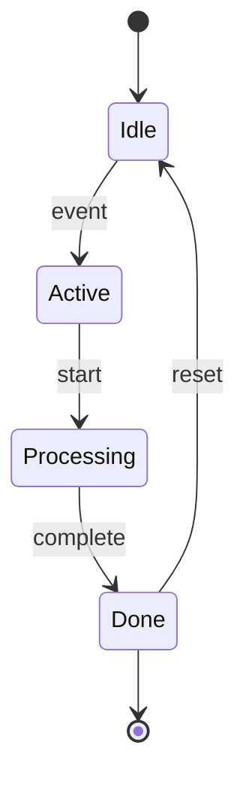
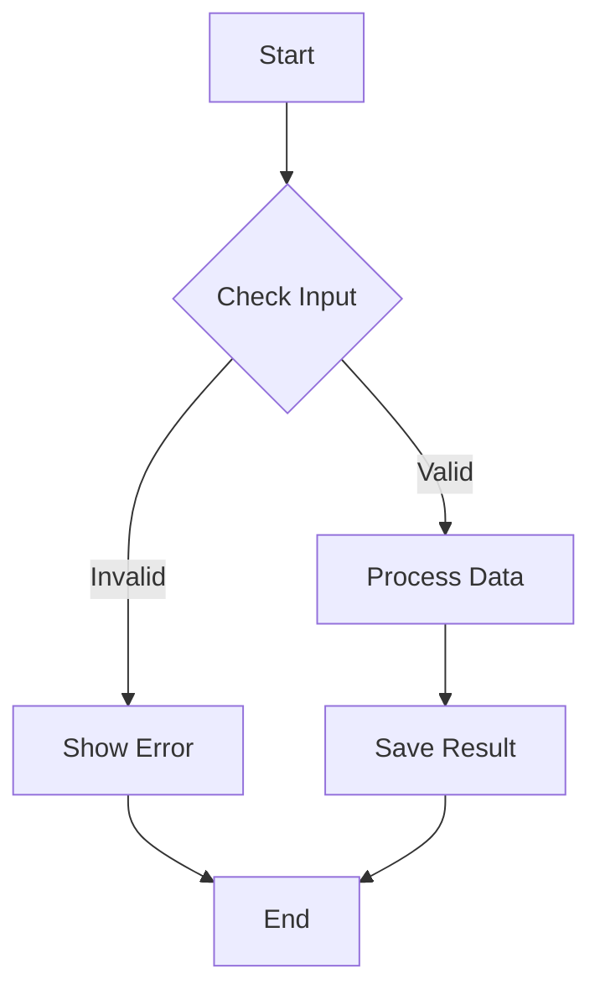
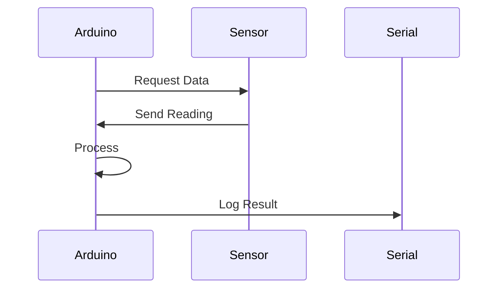
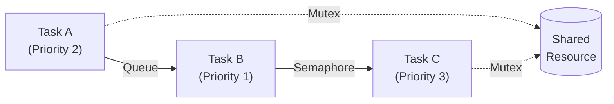
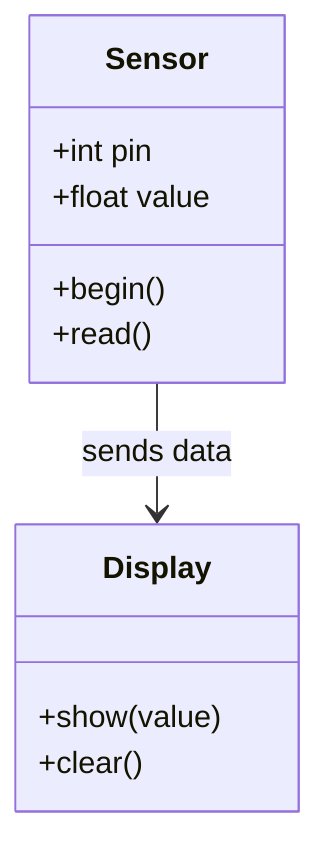

# Mermaid Diagram Templates

## State Machine Template

```mermaid
stateDiagram-v2
    [*] --> Idle
    Idle --> Active: event
    Active --> Processing: start
    Processing --> Done: complete
    Done --> Idle: reset
    Done --> [*]
```

## Flowchart Template

```mermaid
flowchart TD
    A["Start"] --> B{"Check Input"}
    B -->|Valid| C["Process Data"]
    B -->|Invalid| D["Show Error"]
    C --> E["Save Result"]
    D --> F["End"]
    E --> F
```

## Timing/Sequence Template

```mermaid
sequenceDiagram
    participant Arduino
    participant Sensor
    
    Arduino->>Sensor: Request Data
    Sensor->>Arduino: Send Reading
    Arduino->>Arduino: Process
    Arduino->>Serial: Log Result
```

## FreeRTOS Architecture Template

```mermaid
flowchart LR
    TaskA["Task A<br/>(Priority 2)"] -->|Queue| TaskB["Task B<br/>(Priority 1)"]
    TaskB -->|Semaphore| TaskC["Task C<br/>(Priority 3)"]
    TaskA -.->|Mutex| SharedResource[(Shared<br/>Resource)]
    TaskC -.->|Mutex| SharedResource
```

## Class Diagram Template

```mermaid
classDiagram
    class Sensor {
        +int pin
        +float value
        +begin()
        +read()
    }
    
    class Display {
        +show(value)
        +clear()
    }
    
    Sensor --> Display: sends data
```
